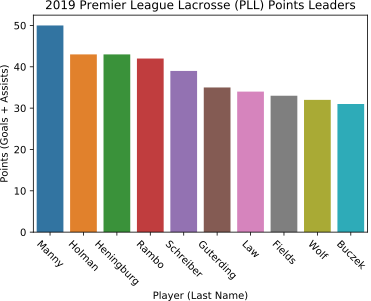
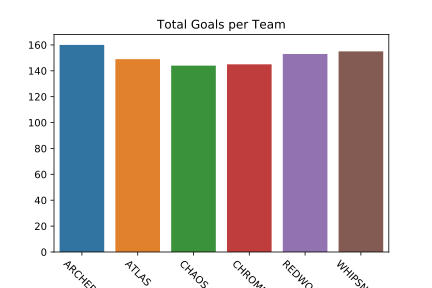

# PLL-Season1-Analysis
An in progress project analysing the game statistics from the first season (2019) of the Premier Lacrosse League (PLL).

This analysis of the first Premier Lacrosse League (PLL) season serves multiple purposes: 
- learning more about data cleaning, feature engineering, data analysis
- providing insight about teams, individual players and overall trends from the analysis.

## 1. Problem Statement
Hardly any data analysis exists for professional lacrosse. For a sport with a lot of potential metrics there is no consensus on what are the most important indicators of future success. Additionally, as PLL rules differ slightly from college lacrosse, the main pathway into the professional ranks, it can be hard to predict success for new draft picks. 

These two problems are to be addressed here.

## 2. Data Description
The data was acquired from the premier league lacrosse website and extracted as raw HTML. The Pandas library was then used to extract the relevant tables direct from HTML. Extensive data cleaning was then performed to ready the data for analysis as the plain text available was not amenable to extracting variables.

## 3. Current Results and Findings
### Points Leaders

 

### Total Goals by team:

