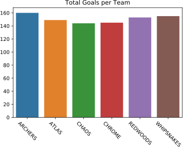

# PLL-Season1-Analysis
An in progress project analysing the game statistics from the first season (2019) of the Premier Lacrosse League (PLL).

This analysis of the first Premier Lacrosse League (PLL) season serves multiple purposes: 
- learning more about data cleaning, feature engineering, data analysis
- providing insight about teams, individual players and overall trends from the analysis.

## 1. Problem Statement
Hardly any data analysis exists for professional lacrosse. For a sport with a lot of potential metrics there is no consensus on what are the most important indicators of future success. Additionally, as PLL rules differ slightly from college lacrosse, the main pathway into the professional ranks, it can be hard to predict success for new draft picks. 

These two problems are to be addressed here.

## 2. Data Description
The data was acquired from the premier league lacrosse website and extracted as raw HTML. The Pandas library was then used to extract the relevant tables direct from HTML. Extensive data cleaning was then performed to ready the data for analysis as the plain text available was not amenable to extracting variables.

## 3. Current Results and Findings

 

Generally players who scored the most scored more per game. The outlier being Matt Rambo who ended up as league MVP.

 

 

One interesting insight is that balanced scoring seems to be key. You might imagine that the team with the most players in the top 10, based on points, would have the best season. However, we can see that despite having 3 players in the points top 10, the Archers only managed to finish 4th overall. Whipsnakes the eventual winners only had one player in the top 10 indicating either a good defence or a balanced scoring effort. 

 

| Team | No. of Players Player in Top 10 for points | Final Ranking |
|------|----------------------------------------|---------------|
| ARC  | 3                                      | 4             |
| ATL  | 2                                      | 5             |
| CHR  | 2                                      | 6             |
| WHP  | 1                                      | 1             |
| CHA  | 1                                      | 3             |
| RED  | 1                                      | 2             |

 

Balanced scoring does seem to be key as we can see the Whipsnakes, the eventual winners, while only having one player ranked in the top 10 (Rambo, the league MVP) scored the second highest total number of goals (155).

 

The defense of the Whipsnakes appears to be the differentiating factor the conceeded the fewest amount of goals of any team (134) although Archers weren't far behind (138).

